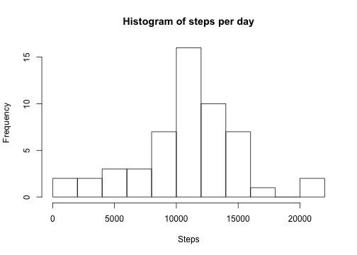
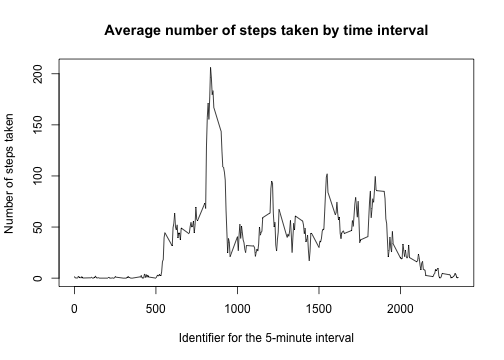
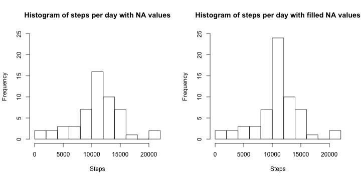
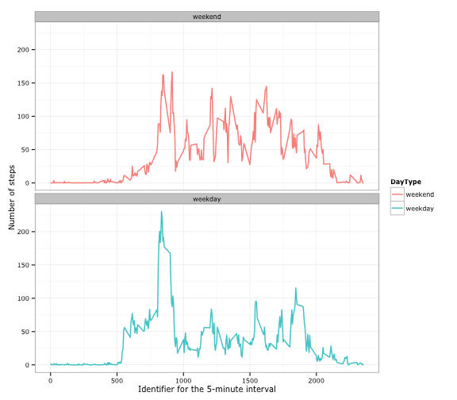

## Loading and preprocessing the data

To begin the research we need to download the archive with data and unzip it.


```r
tempfile <- tempfile()
url <- "https://d396qusza40orc.cloudfront.net/repdata%2Fdata%2Factivity.zip"
download.file(url, tempfile, method="curl")
unzip(tempfile)  # unzip our archive
unlink(tempfile) #delete temporary file
```

Now we have to read the data.


```r
data <- read.csv("activity.csv", header=TRUE)
```

The variables included in this dataset are:

* steps: Number of steps taking in a 5-minute interval (missing values are coded as NA)
* date: The date on which the measurement was taken in YYYY-MM-DD format
* interval: Identifier for the 5-minute interval in which measurement was taken

There are a total of 17,568 observations in this dataset.

That is how it looks like

```r
library(xtable)
d <- xtable(head(data))
print(d, type="html")
```

<!-- html table generated in R 3.1.2 by xtable 1.7-4 package -->
<!-- Thu Apr  9 00:24:42 2015 -->
<table border=1>
<tr> <th>  </th> <th> steps </th> <th> date </th> <th> interval </th>  </tr>
  <tr> <td align="right"> 1 </td> <td align="right">  </td> <td> 2012-10-01 </td> <td align="right">   0 </td> </tr>
  <tr> <td align="right"> 2 </td> <td align="right">  </td> <td> 2012-10-01 </td> <td align="right">   5 </td> </tr>
  <tr> <td align="right"> 3 </td> <td align="right">  </td> <td> 2012-10-01 </td> <td align="right">  10 </td> </tr>
  <tr> <td align="right"> 4 </td> <td align="right">  </td> <td> 2012-10-01 </td> <td align="right">  15 </td> </tr>
  <tr> <td align="right"> 5 </td> <td align="right">  </td> <td> 2012-10-01 </td> <td align="right">  20 </td> </tr>
  <tr> <td align="right"> 6 </td> <td align="right">  </td> <td> 2012-10-01 </td> <td align="right">  25 </td> </tr>
   </table>

Lets remove rows with NA steps.

```r
data2 <- filter(data, is.na(data$steps)==FALSE)
```


## What is mean total number of steps taken per day?
Calculate the total number of steps taken per day


```r
library(plyr)
DaySteps <- ddply(data2, .(date), summarize, steps=sum(steps))
```

Make  a histogram of the total number of steps taken each day


```r
hist(DaySteps$steps,breaks=8, xlab="Steps", main="Histogram of steps per day")
```

 

Calculate and report the mean and median of the total number of steps taken per day

```r
Smean <- mean(DaySteps$steps)
Smean
```

[1] 10766.19

```r
Smed <- median(DaySteps$steps)
Smed
```

[1] 10765

So the mean of the total number of steps taken per day is **1.0766189 &times; 10<sup>4</sup>** and the median of steps taken per day is **10765**

## What is the average daily activity pattern?

Make a time series plot of the 5-minute interval (x-axis) and the average number of steps taken, averaged across all days (y-axis)


```r
IntervalSteps <- ddply(data2, .(interval), summarize, avgsteps=mean(steps))
plot(IntervalSteps$interval, IntervalSteps$avgsteps, main="Average number of steps taken by time interval", type="l", xlab="Identifier for the 5-minute interval", ylab="Number of steps taken")
```

 

Lets compute which 5-minute interval, on average across all the days in the dataset, contains the maximum number of steps.

```r
intmax <- which(IntervalSteps$avgsteps==max(IntervalSteps$avgsteps))
IntervalSteps$avgsteps[intmax] # max number of steps taken in interval
```

[1] 206.1698

```r
IntervalSteps$interval[intmax] # the interval with max steps taken
```

[1] 835

So the 5-minute interval that contains the maximum number of steps is **835**

## Imputing missing values

Calculate and report the total number of missing values in the dataset (i.e. the total number of rows with NAs)

```r
sum(is.na(data))
```

[1] 2304

Lets make a new dataset with filling in all of the missing values in the dataset with the mean of this 5-minute interval over all days.


```r
dataFill <- data
for (i in 1:length(dataFill$steps)) {
        if (is.na(dataFill$steps[i])==TRUE) dataFill$steps[i] <- mean(dataFill$steps[data$interval==dataFill$interval[i]], na.rm=TRUE)
    }
```

Make a histogram of the total number of steps taken each day and Calculate and report the mean and median total number of steps taken per day.


```r
library(plyr)
DaySteps2 <- ddply(dataFill, .(date), summarize, steps=sum(steps))
```

Make  a histogram of the total number of steps taken each day


```r
par(mfrow=c(1,2))
hist(DaySteps$steps,breaks=8, xlab="Steps", main="Histogram of steps per day with NA values", ylim=c(0,25))
hist(DaySteps2$steps,breaks=8, xlab="Steps", main="Histogram of steps per day with filled NA values", ylim=c(0,25))
```

 


As we see on the histograms and as it should be the total amount of steps made increased because we added to the data some more "steps" taken that were totaly omited when they were NA.

Calculate and report the mean and median of the total number of steps taken per day in new dataset.

```r
Smean2 <- mean(DaySteps2$steps)
Smean2
```

[1] 10766.19

```r
Smed2 <- median(DaySteps2$steps)
Smed2
```

[1] 10766.19

So the mean of the total number of steps taken per day is **1.0766189 &times; 10<sup>4</sup>** (before filling NA values it was the same) and the median of steps taken per day is **1.0766189 &times; 10<sup>4</sup>** (before filling NA values it was **10765**)

## Are there differences in activity patterns between weekdays and weekends?

Create a new factor variable in the dataset with two levels – “weekday” and “weekend” indicating whether a given date is a weekday or weekend day.

*I live in Russia and my default language in R is Russian, so R by default interprets "saturday" like "суббота" and "sunday" like "воскресенье".*


```r
for (i in 1:length(dataFill$steps)) {
        if (weekdays(as.Date(dataFill$date[i]))=="суббота" | weekdays(as.Date(dataFill$date[i]))=="воскресенье") dataFill$DayType[i] <- "weekend"
        else dataFill$DayType[i] <- "weekday"
    }
dataFill$DayType <- factor(dataFill$DayType)
dataFill$DayType <- relevel(dataFill$DayType, "weekend") # for making the weekend the first level of factor
```
    
    
Make a panel plot containing a time series plot of the 5-minute interval (x-axis) and the average number of steps taken, averaged across all weekday days or weekend days (y-axis).


```r
IntervalSteps2 <- ddply(dataFill, .(interval, DayType), summarize, avgsteps=mean(steps))
library(ggplot2)
g <- ggplot(IntervalSteps2, aes(interval,avgsteps))
g + geom_path(aes(color=DayType), alpha=0.8, size=0.7)+
facet_wrap(~ DayType, ncol=1, nrow=2)+
labs(x = "Identifier for the 5-minute interval", y="Number of steps")+
theme_bw(base_family="Verdana", base_size=10)
```

 

So, as we see there is a differt pattern of "taking steps" on weekdays and weekend. On weekdays people make maximum steps in the morning (may be because of jogging), but not taking much steps other time through the day. Oppositly, on weekends people walk alot through the whole days. Thanks for your attention:) 
